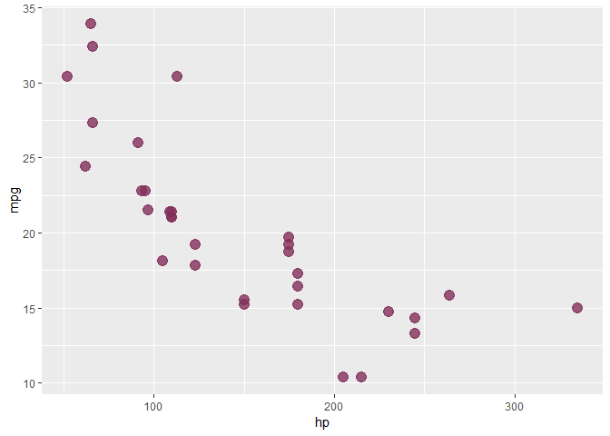
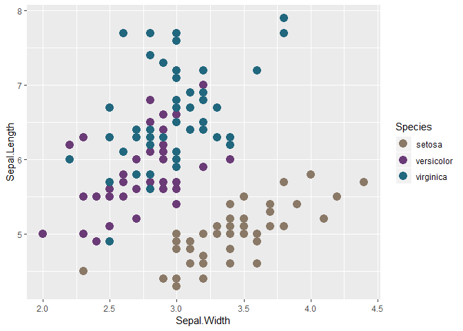
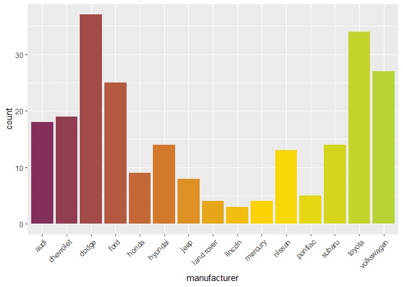
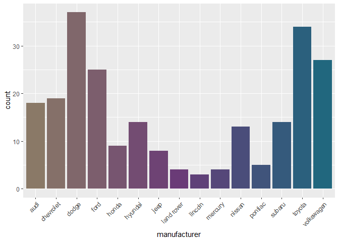

README
================

This R packages includes the [official MRC colour palette](https://mrc.ukri.org/about/information-standards/mrc-brand-guidelines/colour-palette/) spilt into primary and secondary. This package was created following [this](https://drsimonj.svbtle.com/creating-corporate-colour-palettes-for-ggplot2) example. For questions, contact me via e-mail: alex.quent at mrc-cbu.cam.ac.uk.

Example usage of MRColour
==========================

``` r
library(ggplot2)
library(MRColour)

# Primary 
mrc_pal("primary")(3)
```

    ## [1] "#8A7967" "#6A3B77" "#21677E"

``` r
mrc_pal("primary")(10)
```

    ##  [1] "#8A7967" "#826B6A" "#7B5D6E" "#744F71" "#6D4175" "#613F77" "#514979"
    ##  [8] "#41537A" "#315D7C" "#21677E"

``` r
# Secondary
mrc_pal("secondary")(3)
```

    ## [1] "#822F5A" "#E7A618" "#B5D334"

``` r
mrc_pal("secondary")(10)
```

    ##  [1] "#822F5A" "#9B454C" "#B55B3F" "#D07232" "#DF9421" "#EFB810" "#FFDB00"
    ##  [8] "#E6D811" "#CDD522" "#B5D334"

``` r
# ggplot functions
ggplot(mtcars, aes(hp, mpg)) +
  geom_point(color = mrc_cols("red"),
             size = 4, alpha = .8)
```



``` r
ggplot(iris, aes(Sepal.Width, Sepal.Length, color = Species)) +
  geom_point(size = 4) +
  scale_color_mrc()
```



``` r
ggplot(mpg, aes(manufacturer, fill = manufacturer)) +
  geom_bar() +
  theme(axis.text.x = element_text(angle = 45, hjust = 1)) +
  scale_fill_mrc(palette = "secondary", guide = "none")
```



``` r
ggplot(mpg, aes(manufacturer, fill = manufacturer)) +
  geom_bar() +
  theme(axis.text.x = element_text(angle = 45, hjust = 1)) +
  scale_fill_mrc(palette = "primary", guide = "none")
```


